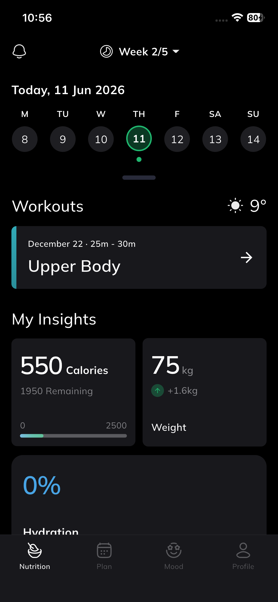
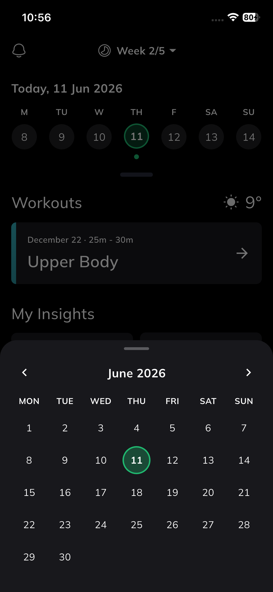
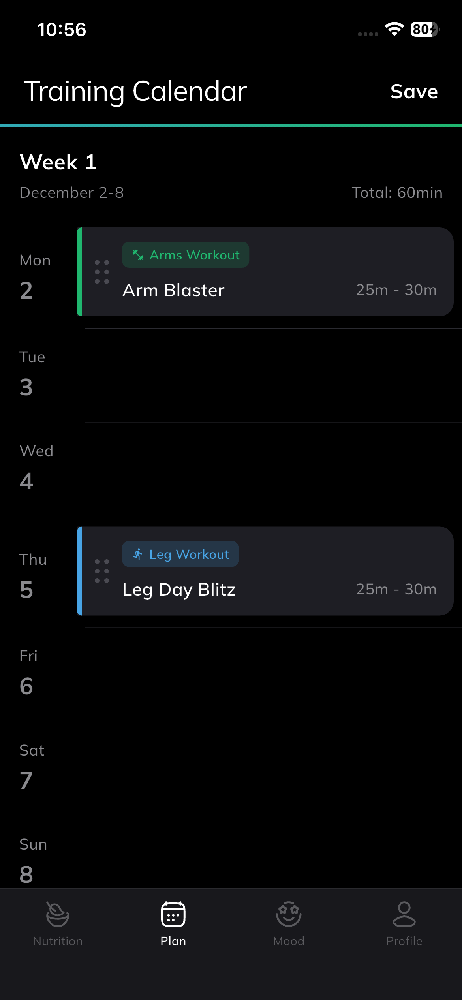
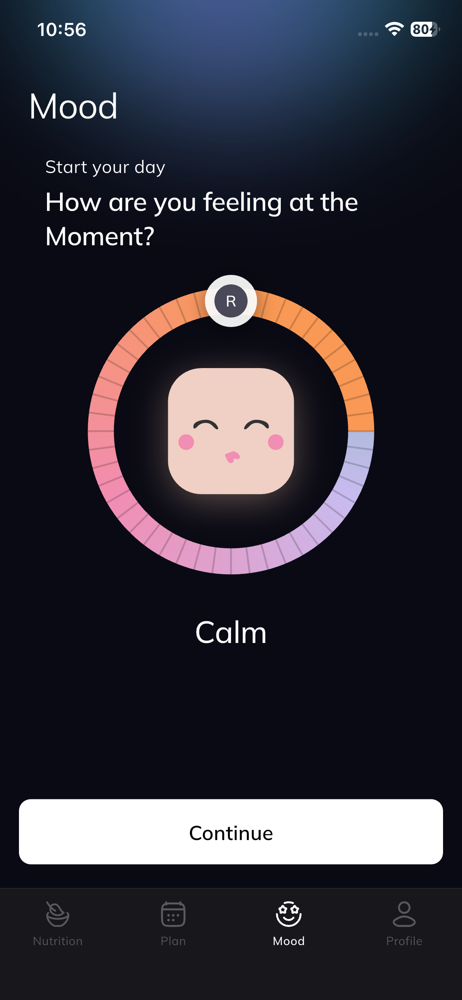

# evencir_test

# Flutter Interview Test Task

## 📱 Project Overview

A Flutter application developed as part of the interview assessment task. The application demonstrates clean architecture, state management, API integration, and responsive UI implementation.

---

# 📦 Dependencies Used & Why

| Dependency             | Purpose                                                              |
| ---------------------- | -------------------------------------------------------------------- |
| `dio`                  | Used for making API requests and handling network calls efficiently. |
| `flutter_bloc`         | Used for state management and separation of business logic from UI.  |
| `equatable`            | Simplifies object comparison and improves Bloc state handling.       |
| `get_it`               | Dependency injection and service locator implementation.             |
| `injectable`           | Generates dependency injection boilerplate code.                     |
| `json_annotation`      | Supports JSON serialization and deserialization.                     |
| `json_serializable`    | Generates model serialization code automatically.                    |
| `go_router`            | Application routing and navigation management.                       |
| `cached_network_image` | Efficient image loading and caching.                                 |
| `flutter_svg`          | Displays SVG images and icons.                                       |
| `logger`               | Application logging and debugging.                                   |
| `shared_preferences`   | Stores local application preferences and settings.                   |

> Replace the dependencies above with the actual packages used in your project.

---

# 🏗️ Project Structure

```text
lib/
│
├── core/
│   ├── constants/
│   ├── network/
│   ├── routes/
│   ├── services/
│   └── utils/
│
├── features/
│   ├── feature_name/
│   │   ├── data/
│   │   │   ├── models/
│   │   │   ├── repositories/
│   │   │   └── data_sources/
│   │   │
│   │   ├── domain/
│   │   │   ├── entities/
│   │   │   ├── repositories/
│   │   │   └── usecases/
│   │   │
│   │   └── presentation/
│   │       ├── bloc/
│   │       ├── pages/
│   │       └── widgets/
│
├── injection/
│
└── main.dart
```

### Folder Explanation

#### `core/`

Contains reusable application-wide functionality such as:

* API client configuration
* App constants
* Utility functions
* Routing configuration
* Shared services

#### `features/`

Contains feature-based modules following Clean Architecture principles.

##### `data/`

* API models
* Repository implementations
* Remote/local data sources

##### `domain/`

* Business entities
* Repository contracts
* Use cases

##### `presentation/`

* UI screens
* Widgets
* State management (Bloc/Cubit)

#### `injection/`

Dependency injection setup using GetIt and Injectable.

#### `main.dart`

Application entry point.

---

# 📸 App Screenshots

### Home Screen



### Home Screen Calender



### Plan Screen



### Mood Screen



### Screenshots Folder

[View All Screenshots](https://github.com/DeveloperKhurramNaseem/evencir_test_task/tree/main/screenshots)

---

# 🎥 App Demo Video

Watch a complete walkthrough of the application:

[Watch App Demo Video](https://drive.google.com/file/d/1lxvN0WpaZxP6OdI3F-59PLqO7RbMsVph/view?usp=sharing)

---

# 📲 Download APK

Download and install the latest APK:

[Download APK](https://github.com/DeveloperKhurramNaseem/evencir_test_task/releases/download/v1.0.0/app-release.apk)

---

# 🚀 Getting Started

## Prerequisites

* Flutter SDK
* Dart SDK
* Android Studio / VS Code
* Android Emulator or Physical Device

## Installation

```bash
git clone https://github.com/username/project-name.git

cd project-name

flutter pub get

flutter run
```

---

# 🛠️ Build APK

```bash
flutter build apk --release
```

Generated APK location:

```text
build/app/outputs/flutter-apk/app-release.apk
```

---

# 📧 Submission

GitHub Repository Link should be shared via email:

**[evencirhr@gmail.com](mailto:evencirhr@gmail.com)**

---

# 👨‍💻 Developer

Your Name

Flutter Developer

